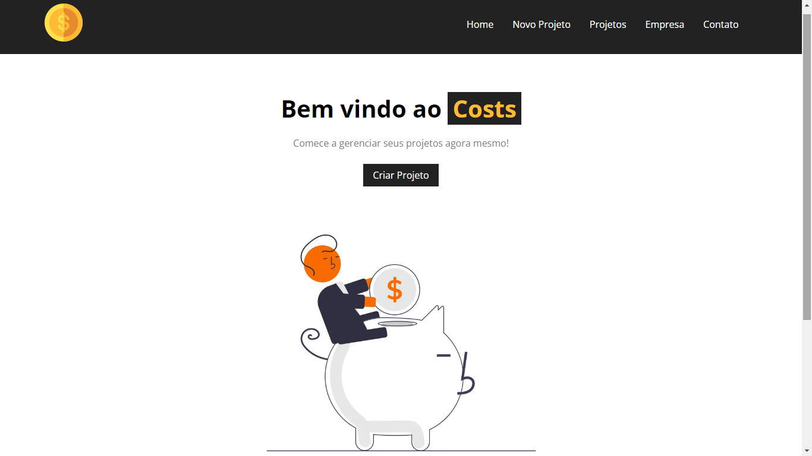
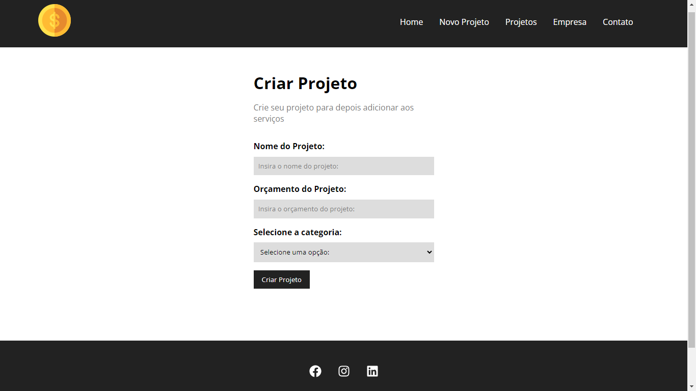
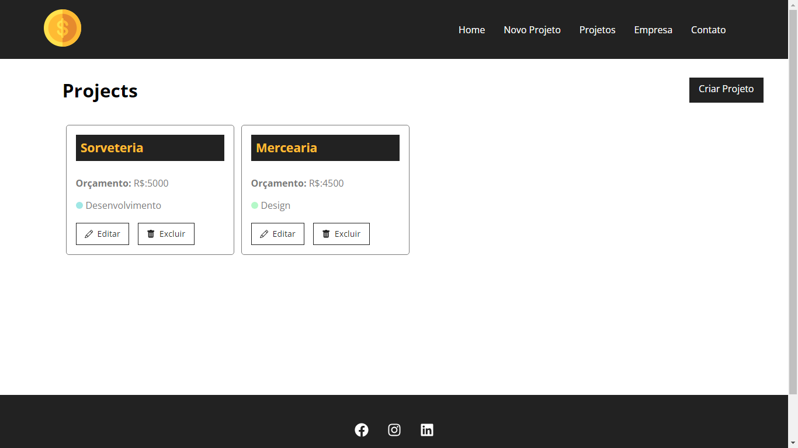
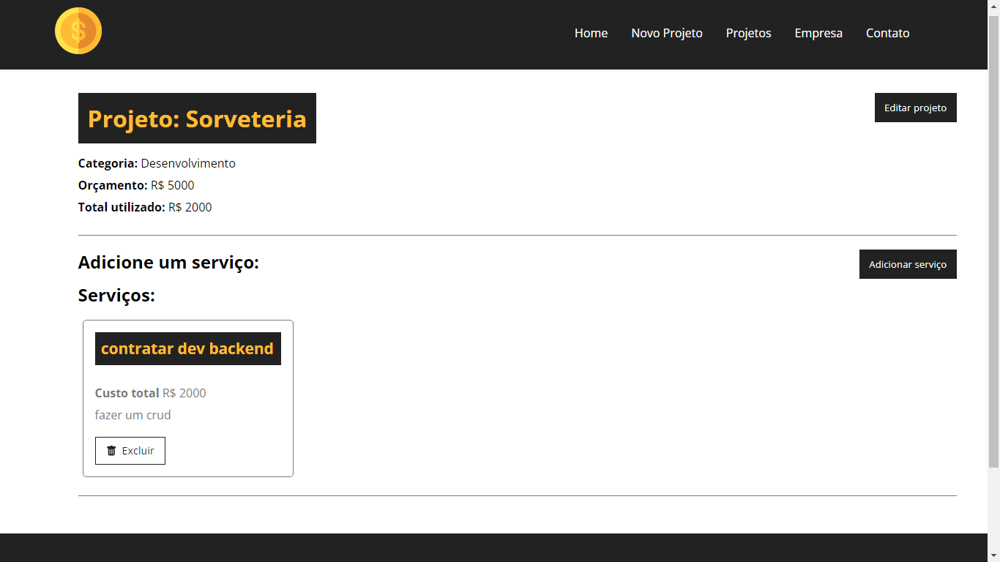

<p align="center">
  
</p>

## <p align="center">Costs</p>

<p align="center">
   
   
   
   
</p>

<p align="center">Costs é a plataforma certa para você que deseja realizar um melhor gereciamento de projetos.</p>


## 📸 Screenshots
<div align="center" justify-content="space-around">
  
  
  
  
</div>

## 🎥 Preview

<p align="center">
  
</p>

## 🚀 Rodando localmente

Clone o projeto

```bash
  git clone https://github.com/ismael-henrique-dev/Costs.git
```

Entre no diretório do projeto

```bash
  cd Costs
```

Instale as dependências

```bash
  npm install
```

Inicie a aplicação

```bash
  npm run dev
```

Inicie o servidor

```bash
  npm run backend
```

## 💻 Tecnologias Utilizadas
- 
- 
-   
- 
- 

## 🛠️ Funcionalidades

- Persistência de dados
- Adicionar/Remover/Alterar projetos
- Adicionar/Remover/Alterar serviços

## 🎓 Aprendizado

Esse projeto foi realizado por meio do <a href="https://youtube.com/playlist?list=PLnDvRpP8BneyVA0SZ2okm-QBojomniQVO&si=QY90cDA-o47BM-77">[Curso de React]</a> do canal Hora de Codar com Matheus Battisti, ao fazer esse projeto consegui absorver mais conhecimentos em React e do própio JavaScript, como `fetch` que aqui foi trabalhado no consumo de api simulando um banco de dados com o JSON Server, com isso veio as `promises` que tive um pouco de dificuldade em aprender, mas com o decorrer do projeto consegui superar esses desafios. Outras coisas que consegui aprender com o projeto foi algumas `boas práticas` no código e também consegui melhorar um pouco minha lógica de programação.
